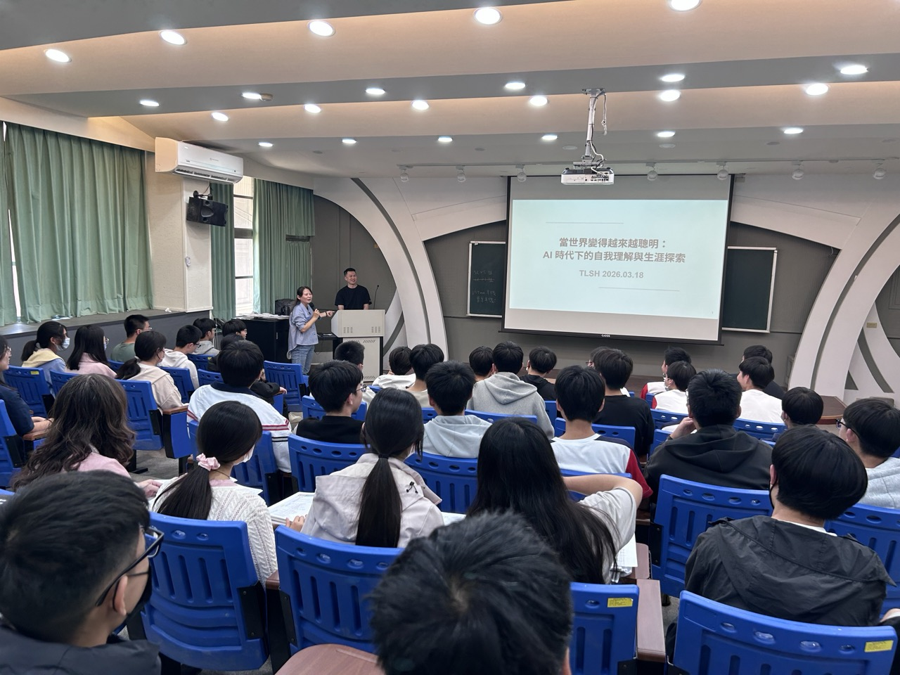
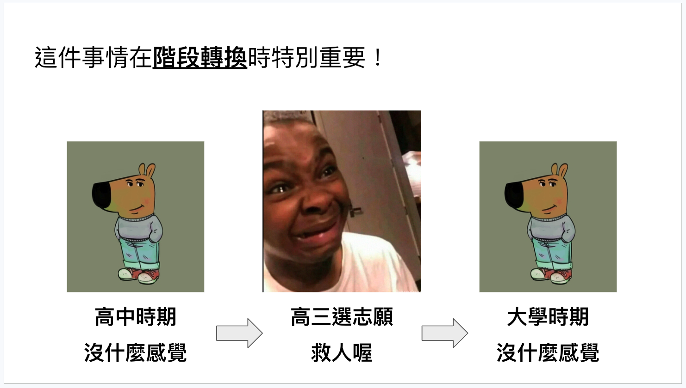
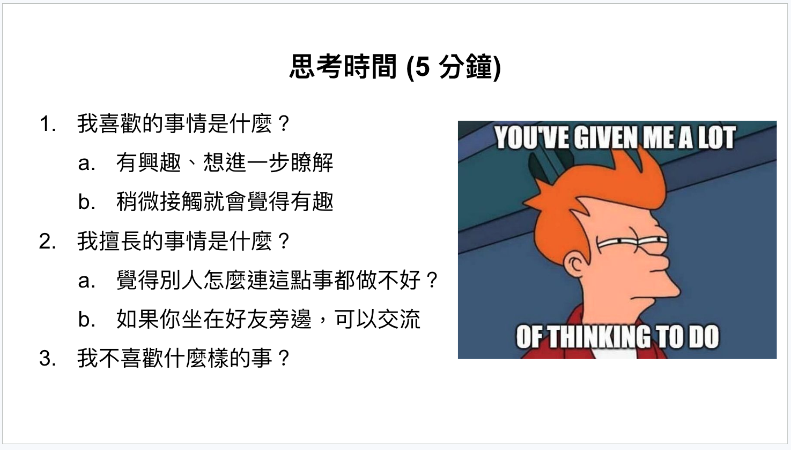

## TL;DR

前陣子有機會受邀回母校斗六高中，和在校的學弟妹分享一個當年自己不熟悉的主題：

> **我們該如何理解自己，並做出選擇？**

這場分享主要談了三件事情 :

1. 多數人都是在需要做選擇時，才發現自己還不夠理解自己。
2. 探索的過程，不一定是找到答案，也可以是逐步排除。
3. 當世界變動時，真正穩定的，是你對自己的理解。

---

## 寫給過去的自己

坦白說，高中時期的我，完全不懂為什麼要自我探索。

準備這次分享時，我一直抱持著一種心態：**如果我能回到高中時期，我會對那時候的自己說些什麼？**

所以在那兩個小時裡，我設定的目標聽眾，其實就是高中時迷惘的自己。

這不是什麼成功經驗談，反而更像是從過去的「翻車」經驗中，整理出的反思。

---

## 自我探索平常不重要，關鍵時刻卻很致命

在我看來「自我理解」和「生涯探索」有一個特色：

> 平常毫不重要，直到你遇到人生的決策點。

在日常生活中，「不夠理解自己」通常不是什麼大問題。

高一、高二時，大家的日子看起來差不多：上課、考試、社團、回宿舍，但到了某個「決策點」，問題會突然浮現。

人生中會有一些常見的「決策點」，例如：

+ 高三選科系
+ 大學畢業後要不要讀研究所？
+ 第一份工作要做什麼
+ 工作幾年後，要不要換跑道？

許多人都是在遇到「決策點」時，才開始意識到 :

> **原來我根本還不知道自己想要什麼。**

---

## 高三選科系，是我第一次感受到焦慮

回頭看過去的人生，第一次明顯感受到「生涯探索」壓力的時間點，就是在高三選科系時。

在考完學測準備填志願時，開始有種感覺：**這次的選擇似乎跟以往不太一樣。**

國三要畢業時，事情似乎沒有那麼複雜，因為不論念哪間高中，似乎差異不會很大，只是學校風格不同而已。

但選大學科系不太一樣，那是第一次，我開始意識到**自己和身邊的同學，接下來真的要走上不同的路了**。

而且隱約感覺到：**自己的人生，很可能會因為這個選擇而有所不同。**

突然間備感壓力，尤其是，當時的我根本不知道該如何選擇。

我記得在高二下學期開始，就會有輔導老師開始宣導：要做功課、試著了解自己，規劃之後的科系。

然而，我高中時的規劃能力非常有限，當初最常規劃的是「從教室奔跑到宿舍餐廳的最短路徑」，因為如果午餐時間太晚到餐廳，你就只能「望雞腿而興嘆」。

回到選科系的前夕，當時不知道怎麼辦的我我，做了哪些事？

大概就是：

+ 做一些適性測驗
+ 開始看不同科系在做什麼
+ 試著想像自己未來可能會做什麼工作

最後我是怎麼做決定的？老實說，非常粗糙。

我不喜歡物理和化學，所以不想往那個方向走。

我曾經跟我爸說，不然我去當導遊好了。我爸回我一句：「要當導遊，你不一定要念大學。」

最後我是怎麼做出選擇的呢？

> 我喜歡玩電腦，不然就選資訊相關科系好了。

現在回頭看，雖然不是瞎猜，但這個決策建立在「非常有限」的資訊上，而且下的非常倉促。

我想，這正是很多人在高三會遇到的狀況。

> 當你意識到需要探索時，通常已經有點晚了。

---

## 生涯探索，不是找到答案

我以前對「生涯探索」的想像就像是哈利波特中的分類帽。

做個測驗，結果出來，啪！答案就有了。

我適合當老師、我適合當工程師、我適合念某某系。

我從此明白我的志業是什麼，並且可以充滿自信的全力前進。

但後來發現這種期待有兩個問題。

第一個問題是：**科系和職業，並不一定是一對一的關係。**

有些路徑看起來比較直觀，像是醫學系對醫師、藥學系對藥師。

但更多時候，事情不是這麼單純。

同樣是資訊相關科系，未來可能去寫程式、做產品、做資料分析、做顧問、做設計、做研究、做教育，甚至做完全不同的工作。

第二個問題是：**學生時期的我們，對職業的理解通常很片面**。

除非家裡剛好有人在做那一行，否則你對很多職業的認識，可能都只是模糊的印象。

職業本身也在變。有些現在很常見的工作，在幾年前根本不存在；有些以前很穩定的職位，也可能在未來逐漸消失。

如果世界本身就在變，那我們怎麼可能在高中階段，就對未來做出毫不遲疑、百分之百正確的判斷？

所以對現在的我來說，「生涯探索」其實 :

> 不是立刻找到唯一正解，而是逐步縮小自己不適合、沒感覺、不想走的方向。

換句話說，探索的目的，不一定是找到正確答案。

> 知道自己不適合什麼，有時候跟知道自己喜歡什麼一樣重要。

---

## 比起想做什麼職業，更重要的是想做什麼事情

如果職業不是那麼容易提早確定，那我們還能做什麼？

我們可以換個問法，不是問：我未來想做什麼職業？

而是問：**我想做什麼事情？**

這是個大哉問，而且很難直接回答。

我記得在[《發現你的天職》](https://www.eslite.com/product/1001125812681958231005)這本書裡，有提供一個系統性的方法來尋找答案，從幾個問題開始尋找線索：

1. 我喜歡的事情是什麼？
2. 我擅長的事情是什麼？
3. 我不喜歡什麼樣的事情？

「職業」像是一個標籤，「事情」比較接近真實的喜好、能力與感受。

這些答案，會慢慢幫你理解，自己適合什麼樣的工作型態、成就感來自哪裡、什麼環境會讓你長得比較好。

而這些，往往比一個過早決定的職稱更重要。

---

## 大學是一個珍貴的實驗場

如果前面提到的問題，開始出現一些模糊的答案，或至少有一些「好像是這樣」的線索，接下來的重點不是想得更清楚，而是找機會去驗證。

大學最珍貴的地方，在於提供了一段相對自由、可以大量嘗試的時間。

我覺得大學就像是一個「實驗場」，你有機會去是很多事情。

但前提是，**你手上要有一些「實驗素材」**，也就是那些還沒被驗證的想法，例如：

+ 我「好像」喜歡教別人東西。
+ 我「好像」不喜歡工作的時候一直有人打斷我。
+ 我「好像」很喜歡小孩。

這些都不是答案，而是線索。

像我自己，是在大學時慢慢發現，我好像蠻喜歡「教別人東西」：站在台上分享，把複雜的東西講清楚，看到別人因為我的說明而理解一些事，會有一種很直接的成就感。

一但有了這種觀察，就能利用大學時間去做驗證。

我原本以為：喜歡教別人東西就等於適合當老師，所以暑假去偏鄉國小帶營隊。

但實際做過之後才發現，事情和想像的不太一樣：我雖然喜歡教學，但前提是對方能夠專注地聽。而在那樣的環境裡，學生很難被控制；加上我自己其實很喜歡小朋友，反而不太能嚴格管教，最後把自己弄得很累。

最後我了解到，或許我該換種方式來實踐「教別人東西」。

這種驗證後的體悟，是想再多都沒辦法獲得的。

比如說：

+ 如果你覺得自己可能喜歡教學，你可以去做志工、帶營隊、家教
+ 如果你想試試看國外生活，可以去交換
+ 如果你想知道自己喜不喜歡某個產業，可以去實習
+ 如果你喜歡某種運動，可以加入系隊、校隊
+ 如果你想知道自己能不能承受工作節奏，可以去打工

這些看似零碎的嘗試，其實都在幫你累積資訊。

有些結果會告訴你：「這條路好像可以再走深一點。」

有些結果則會告訴你：「喔，原來這不是我要的。」

**這兩種都很有價值。**

因為自我探索，本來就不是坐在原地苦想，而是在生活中不斷做小型實驗。

---

## 出社會後，令人感到不安的空虛感

踏入職場後，自己最大的感受不是「好累」，比較大的衝擊是：原本熟悉的評分系統突然消失了。

在學生時代，我們其實活在一個簡單、有效的系統裡：

> 努力 -> 考試 -> 分數 -> 肯定

這個系統不一定完美，但它很明確。你知道自己處於什麼位置，也知道怎麼追求更高的分數。

可是出社會後，這個系統突然不見了。

沒有人每個月給你考卷、沒有人幫你排年級名次、沒有人告訴你這次的人生考了幾分。

這時候，[我開始不知道該往什麼方向努力](https://minglunwu.com/notes/2025/early-career-reflection/)，也不知道所謂「追求自己熱愛的事」是什麼意思，身旁許多人開始尋找新的「替代標準」。

常見的標準可能是：

+ 薪水
+ 公司名氣
+ 職稱
+ 社會地位

這些東西當然不是完全不重要。

但如果你把它們當成唯一的衡量依據，很容易會慢慢失去和自己的連結。

因為那畢竟是「外部標準」。

而當一個人越來越依賴外部標準，就越容易在世界改變時感到混亂。

---

## 在 AI 時代，更重要的問題是你是什麼樣的人

如果說前面提到的那些「決策點」，已經足夠讓我們意識到自我理解很重要。

那麼 AI 時代，則是把這件事情的重要性又往上推了一層。

因為現在的改變，不只是某一份工作變忙、某一個產業景氣不好。

而是很多職業的邊界，正在慢慢被打破。

尤其對我自己身處的軟體與 AI 領域來說，這個感覺非常明顯，很容易就讓人[陷入一種不踏實的狀態](https://minglunwu.com/notes/2025/ai-knowledge-anxiety/)。

很多原本被認為是某個角色專屬的能力，開始被重新分配；很多工作內容，也正在被重新組合。

於是我們很自然地會開始問：未來什麼能力還重要？什麼工作不容易被取代？

對我來說，問題開始變成：

> 當世界不斷改變時，我到底是什麼樣的人？

面對這個問題，不是要尋找「比較好的答案」，而是慢慢理解自己期待的狀態是什麼？

我對什麼事情會有感覺？又對什麼事情沒有？

我在什麼樣的情境下會投入，什麼時候會開始消耗？

我習慣怎麼做決定？是喜歡先想清楚，還是邊做邊調整？

這些答案會慢慢拼出一個輪廓，讓你在變動裡，不至於失去方向。

這些問題，才是未來會越來越重要的核心。

因為職業可以變，工具可以變，產業也可以變。

但如果你夠理解自己，你就比較有機會在變動裡，持續找到新的位置。

---

## 人生沒有標準答案，自我探索不會有真正畢業那一天

最後我想說的是：自我探索這件事情，不是只有高三才需要做。也不是上大學前做完一次，以後就結束了。

到此時此刻，我也還在持續做這件事，只是迷惘的問題有所不同。

以前可能在想的是：我要念什麼系？我要不要讀研究所？我要找什麼工作？

現在思考的，可能變成：我要不要繼續留在這個城市？我要不要走向不同的職涯角色？我要不要做出另一種生活選擇？

對現在的我來說，自我理解不是一次性的任務，更像是一個動態的過程。

人生本來就沒有標準答案。

很多時候，你不是先有了正確答案才出發。
而是你先出發了，才慢慢知道哪些答案不適合你。

如果你現在是高一、高二，也許可以開始慢慢摸索自己喜歡什麼、擅長什麼、不喜歡什麼。

如果你現在是高三，正在面對某個很重要的選擇，覺得有點不踏實，那也很正常。

迷惘，是因為正在面對一個本來就沒有標準答案的問題。

而我們能做的，不是逼自己立刻找到最完美的答案。

而是多理解自己一點，多做一些嘗試，多留下幾個能幫助未來做選擇的線索。

當世界變得越來越聰明，人反而更需要花時間理解自己。

因為未來真正稀缺的，不是「會做什麼工作的人」，而是那些知道自己為什麼做選擇、也願意持續修正方向的人。

感謝你的閱讀，我們下次見！
