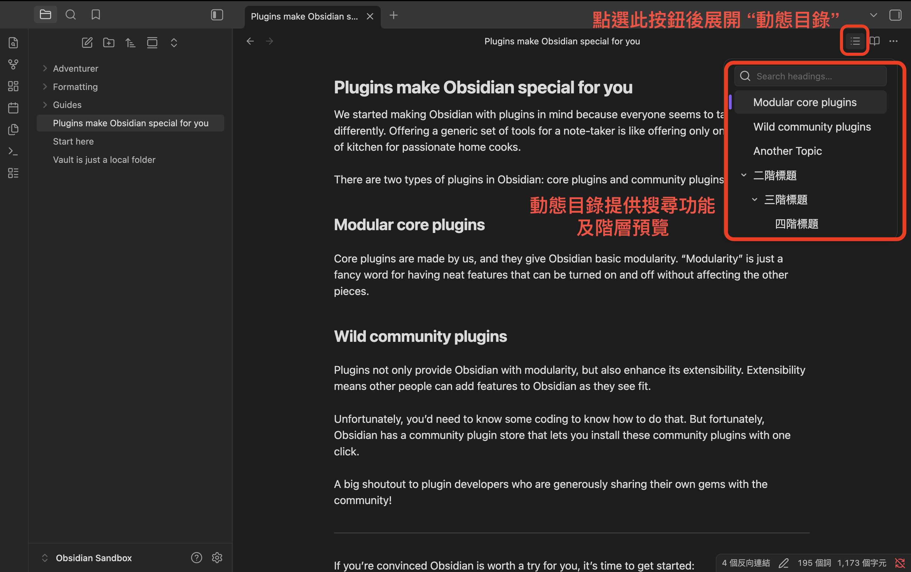
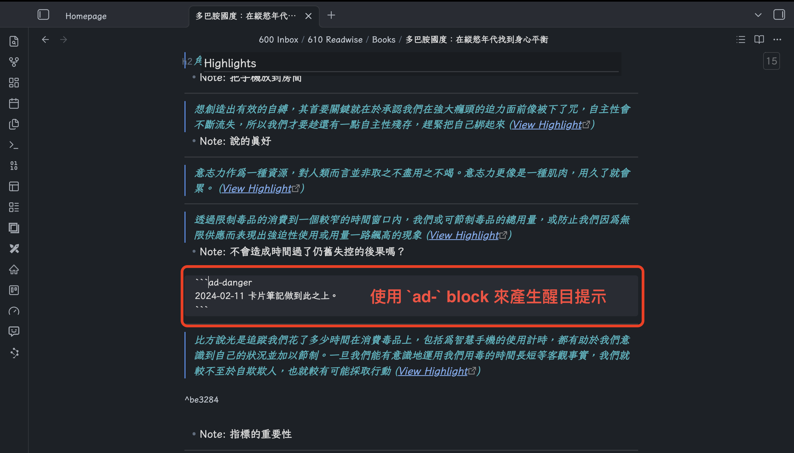
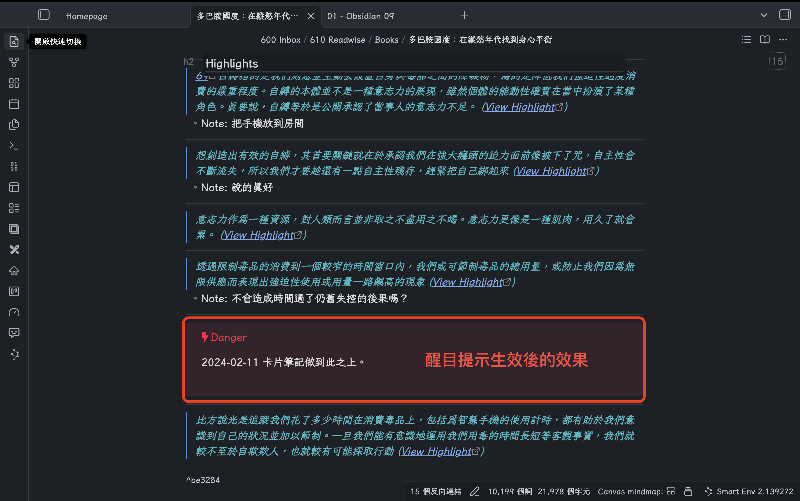
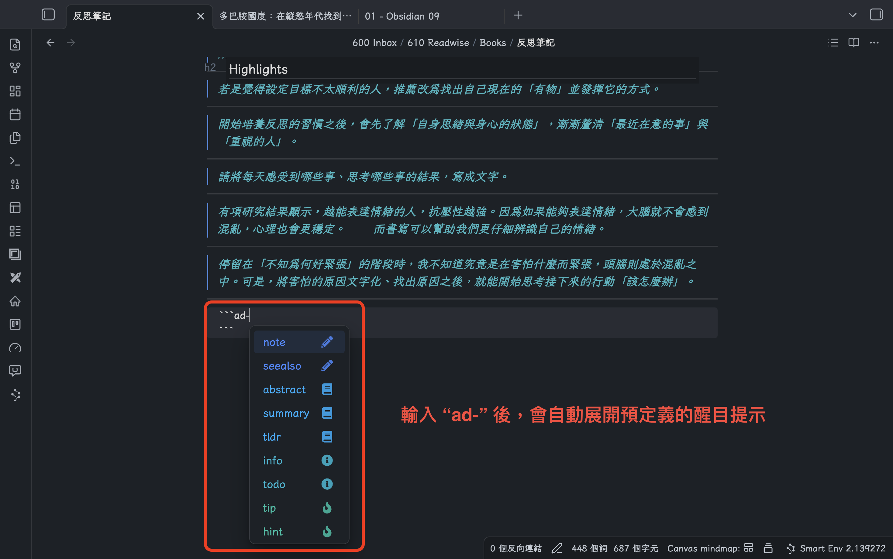
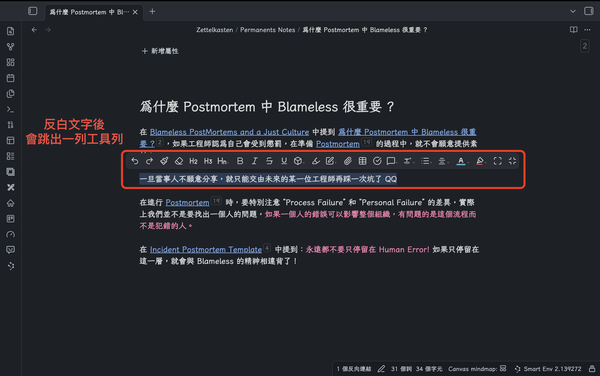

## 先回到寫字這件事

最近 AI Agent 越來越紅，`Obsidian` 也因為以本機 Markdown 檔案為核心的特性，討論度明顯上升了。

這陣子看到很多厲害的分享，教大家如何將 `Obsidian` 和各種 AI 工具串接成高效的工作流程，我也還持續在摸索，在這個潮流中，究竟[該如何與 AI 協作](https://minglunwu.com/notes/2025/ai-knowledge-anxiety/) ？

不過隊伍來說，在討論 `Obsidian` 如何 AI-Friendly 前，先確保 User-Friendly 是很重要的。

畢竟真正負責思考、書寫和累積素材的人，是使用者自己。

不論是零碎想法、筆記片段、閱讀心得甚至是某天突然冒出來的一句話，這些素材都不是憑空出現的。

它們通常來自很普通的時刻：**你打開筆記，坐下來，開始慢慢輸入。**

回到這個系列文的初心，這篇文章想回答一個基本的問題：

> **怎麼把 `Obsidian` 配置成一個比較順手的寫作空間？**

我們在上一篇 "[#8 - 我的 Obsidian 好醜噢！三步讓它變順眼](https://minglunwu.com/notes/2025/obsidian_8.html/)" 主要是在處理「視覺」上的第一印象，這一篇想接著往下談，當畫面變順眼後，接下來要怎麼讓它寫起來更順手？

相信看到這裡，有些觀望的讀者朋友可能已經想抱怨了：

> 「什麼？！我連寫筆記都還要做基本配置？」

沒錯，`Obsidian` 雖然可以直接寫筆記，但加入某些客製化的功能，可以讓寫作體驗更順暢，變成一個讓你安心寫字的空間。

今天我想分享幾個我自己很常用，也很推薦新手優先配置的 Plugin。

如果你對於 `Obsidian` 的 Plugin 功能還不熟悉，歡迎你先看看 :

+ [Obsidian 入坑指南 #5 : 認識 Core Plugin (上)](https://minglunwu.com/notes/2024/obsidian_5.html/)
+ [Obsidian 入坑指南 #6 : 認識 Core Plugin (下)](https://minglunwu.com/notes/2025/obsidian_6.html/)
+ [Obsidian 入坑指南 #7 : 安裝 Community Plugin](https://minglunwu.com/notes/2025/obsidian_7.html/)

---

## [Typewriter-mode](obsidian://show-plugin?id=typewriter-mode)

如果你平常會在 `Obsidian` 中寫比較長的筆記或文章，我強烈推薦先安裝這個 Plugin。

它最主要的功能，是把你的游標固定在螢幕的特定位置。

當你持續換行往下寫時，正在輸入的那一行不會一直往上飄，不需要邊寫邊調整視窗位置。

這是個平常難以意識到的功能，但在寫篇幅較長的筆記或文章時，感受會很強烈。

寫作時畫面一移動，注意力也跟著被拉走，會非常影響寫作節奏。

`1.3.0` 版本後，它也提供了一個有趣的功能 - `Hemingway Mode` ，簡單來說就是停用你的刪除鍵，讓你不能邊寫邊改，只能一路寫下去。

我自己在寫文章初稿時，偶而也會開啟這個模式，很適合那種容易寫十行、改八行的人。

---

## [Dynamic Outline](obsidian://show-plugin?id=dynamic-outline)

如果 `Typewriter-mode` 解決的是「寫不寫得下去」，那 `Dynamic Outline` 幫忙處理的，就是「寫長之後會不會迷路」。

安裝後，右上角會多出一個 `Toggle Dynamic Outline` 的按鈕，點開之後，會展開一個動態目錄，提供各層標題的預覽，也能直接搜尋。

在處理篇幅比較長的筆記或文章時，這個功能很有幫助。

尤其是當你不是從頭一路寫到尾（通常不會是這樣），而是常常在不同段落之間來回修改時，動態目錄會讓你更容易掌握整篇文章的位置。

我自己在整理筆記結構、調整段落順序時，很常用它來快速定位。

---

## [Smart Typography](obsidian://show-plugin?id=obsidian-smart-typography)

接下來這個 Plugin 提供的是一個小且實用的功能。

`Smart Typography` 可以在你輸入特定字元時，自動幫你補齊，例如：

+ `-` + `>` = →
+ `"` = “”
+ `'` = ‘’
+ `+` + `-` = ≥

當你寫作速度快，又常需要輸入符號時，能省下不少零碎操作的時間。

對我來說，這類小細節可以讓我的寫作節奏順暢許多。

---

## [Admonition](obsidian://show-plugin?id=obsidian-admonition)

我在寫筆記時，常會遇到一種情況：有些地方還沒寫完，但當下不想停留在那裡。

這時 `Admonition` 能讓你快速在筆記中加入醒目的提示區塊，幫自己留下路標。

例如我在整理閱讀書籍的筆記時，因為內容太多，沒辦法一次全部整理完，就會先用它標記，提醒自己下次回來要從哪裡接續。

生效後的效果會變成 :

同時這個 Plugin 也提供多種不同的提示樣式可供選用 :

我自己會把它當成一種「暫時停靠點」，當筆記無法一次處理完畢時，我習慣在筆記中留下一個醒目的記號，交接給未來的自己，如同我在[從資訊整理到思考推進：如何紀錄才能讓思考更有價值？](https://minglunwu.com/notes/2025/thinking_notes_principles.html/#2-%E7%B5%90%E6%9D%9F%E6%80%9D%E8%80%83%E5%89%8D%E7%82%BA%E6%9C%AA%E4%BE%86%E7%9A%84%E8%87%AA%E5%B7%B1%E6%95%B4%E7%90%86%E6%96%B9%E5%90%91)中提到的：

> 結束思考前，為未來的自己整理方向。

---

## [Editing Toolbar](obsidian://show-plugin?id=editing-toolbar)

最後這個 Plugin，我特別推薦給開始接觸 `Obsidian` 的新手。

`Obsidian` 的筆記本質上是 Markdown 檔案，所以關於文字的「格式」，例如列點、粗體、斜體、更改顏色，都要透過 Markdown 的語法規範來達成。

如果你本來就熟悉 Markdown，這當然不是什麼大問題；但如果你只是想把筆記先寫出來，**格式語法有時候反而會變成一層額外的負擔**。

`Editing Toolbar` 的作用，就是「**幫助使用者降低這一層門檻**」。

安裝之後，只要把文字反白，就會跳出相關的工具選單，讓你快速調整格式。

對於還不熟悉 Markdown 的使用者來說，這種直覺的設定方式，更為友善。

我自己會將其視為一個很典型的新手友善 Plugin，能有效減少新手使用 `Obsidian` 的阻礙感。

---

## 先把最初的幾步踩穩

這個系列文的初心，是想先幫 `Obsidian` 新手把最前面的幾步走穩。

這篇文章所分享的 Plugin 並非吸睛的新功能，它們處理的，反而是一些很基本、卻很容易默默打斷寫作節奏的小摩擦：

+ 畫面在寫作時一直往上飄
+ 文章太長就迷失在段落中
+ 輸入符號時需要對齊符號

這些事情都不難解決，但累積起來就會讓人覺得 `Obsidian` 的體驗不佳。

所以如果你最近剛開始用 `Obsidian`，又希望它不只是拿來記幾條零碎片段，而是真的能陪你長時間寫字，我會很推薦先從這些基本配置開始。

畢竟在 AI 工作流之前，很多事情還是得先回到最原始的那一步：

> **你願不願意打開這個地方，慢慢把東西寫下來。**

謝謝你的閱讀，我們下次見！

---

## About Byte & Ink

我會定期在部落格分享不同主題的文章，目前包含：

+ [職涯心得](https://minglunwu.com/tags/career/)
+ [個人成長](https://minglunwu.com/categories/reflection/)
+ [筆記軟體 - Obsidian 教學](http://minglunwu.com/categories/obsidian/)
+ 技術相關 (`K8S`, `DevOps`, `軟體測試`...)

如果你覺得內容有幫助，歡迎你[點此](https://minglunwu.substack.com/subscribe)訂閱我的文章，你的訂閱會帶給我更多動力，持續分享有意義的內容！
