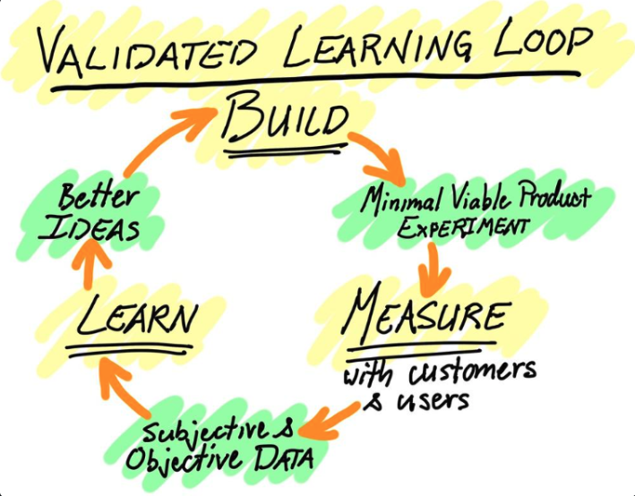

## 重新理解 MVP

我記得這份工作剛 On board 沒多久，在一次跟 Skip manager 的 1 on 1 中，他曾跟我說過一句話：

> 「當你設計出一個 Solution，並且實際規劃、推進，親眼看著它成功落地時，那種成就感是很強烈的。」

過了五年，我還是對這句話印象深刻。

我想每個工程師在練習發揮影響力的過程中，都會經歷這樣的過程：尋找痛點、設計一個產品或 Solution，然後嘗試讓它真正落地。

而構建 MVP (Minimum Viable Product) 往往會是這個過程中很重要的一步。

在這幾年的職涯中，有蠻多機會能練習規劃自己想做的事情。有些成功，有些效果則不太好。

在[去年底的回顧](https://minglunwu.com/notes/2025/engineer-product-thinking/)中，意識到自己常常太早跳進「解決方案」，最近在讀 《User Story Mapping》 的過程中，對 MVP 有了不一樣的體悟，也改變了我對於打造產品/Solution的看法。

---

## PoC 成功，不代表產品假設成立

過去我的習慣是：當 PoC (Proof of Concept) 成功，也就是確認某個產品或解決方案在技術上可行後，下一步就是打造一個 MVP 來運行。

但是 PoC 跟 MVP 有什麼不同呢？

如果不一樣，PoC 成功，代表 MVP 也會成功嗎？

什麼是成功的 MVP 呢？

現在的我會這樣回答：

PoC 比較像是在回答：「這件事技術上做不做得到？」

而 MVP 回答的是：「這個東西值不值得繼續做？」

PoC 關心的是技術可行性，MVP 關心的是產品假設是否成立。

換句話說，能不能做出來是一回事，做出來之後有沒有人需要、會不會真的改變某些行為，是另一回事。

在沒有意識到這個差異前，我把 MVP 視為 PoC 後的下一個工程版本：技術上能運行，就先做一個陽春版的產品，讓它上線看看。

但這也是我後來發現自己可以修正的地方。

---

## 第一個誤解：MVP 不是殘破產品的擋箭牌

《User Story Mapping》 這本書中，把 MVP 的定義分成幾種階段。其中第一個階段，是作者不太認同的定義：

> “The crappiest product you could possibly release.”

也就是：**你所能推出最爛的產品**。

這是一個不好的定義，但如果沒有特別留意，真的很容易落入這種境地。

過去當我提到 "MVP" 時，直覺會理解成「可以試錯的產品」，但**可以試錯，不代表可以隨便出錯**。

當有人提出質疑、建議時，我可能會用：「這只是 MVP，所以先這樣吧。」，藉此來緩解其他人的挑戰。

但當我把「這只是 MVP」變成一種擋箭牌，最後就容易做出一種「自嗨型」的產品：它確實被做出來了，但沒有人真的需要。

你會告訴自己：這個東西也許還是會有人用到。

但究竟是誰？其實你心裡也不知道。

---

## 第二個理解：MVP 是用最小 Output，逼近期待的 Outcome

第二種比較好的定義，是把 MVP 理解成：

> 用最小的 Output，達到你渴望的 Outcome。

Output 和 Outcome 有什麼不同呢？

**Output 指的是從 Idea 到 Delivery 之間的產物，也就是我們實際打造出來的功能、文件、流程或工具。**

**Outcome 則是當 Output 被使用後，實際造成的結果與影響。**

前幾年我常把重點放在 Output：看到新的技術或是工具，就很興奮地想導入到團隊中，告訴主管今年想把這個功能做起來。

不過在職場上，真正能帶來影響力和價值的，通常不是 Output 本身，而是它所造成的 Outcome。

如果嘗試用比較具體的方式來描述 Outcome，我會把它理解成：

> 特定的 User 參與特定的 Activities。

以我過去分享的[《成為更重視 Code Review 的團隊》](https://minglunwu.com/notes/2025/code_review_2.html/) 的內容為例：

當我整理出適合團隊的 Code review guideline、設計出降低推動阻力的方法，這些是 Output。

但如果團隊真的開始更早回覆 PR、更願意留下有品質的 Review comment、更少把架構討論拖到最後一刻，這些行為改變才是 Outcome。

當我們過度關注 Output，而忽略 Outcome 的重要性時，很容易變成[《如何進行產品策略與路線圖規劃》](https://petersuppi.medium.com/%E5%A6%82%E4%BD%95%E9%80%B2%E8%A1%8C%E7%94%A2%E5%93%81%E7%AD%96%E7%95%A5%E8%88%87%E8%97%8D%E5%9C%96%E8%A6%8F%E5%8A%83-bf9b375eb832)文章中提到的 **Feature Factory** :

> 看起來一直在交付功能，但不一定真的達成目標，甚至還可能造成士氣低落。

所以，練習聚焦 Outcome 時，我開始練習問自己一個問題：

> 對目標客群來說，要達到我期待的 Outcome，最小的 Output 是什麼？

要回答這個問題，至少需要先想清楚兩件事：

1. Customer 或 User 是誰？
2. 他們需要什麼？至少要有什麼，才可能滿足需求？

先想過這兩個問題，已經比「直接做一個陽春版產品」好很多。

不過有一個很尷尬的問題存在。

---

## Outcome 無法被預先觀測

問題在於：**在 Outcome 真正出現前，無法被觀測到**。

從 Code Review 的案例來說，設計出的優化流程是 Output，它的目標是希望團隊能建立更好的 Code Review 文化。

但在這個文化真正被建立起來之前，我很難判斷它是否成功。也很難說：「現在 Code Review 文化已經建立了 20%。」

這就是 Outcome 困難的地方。

並不是在 Output 完成的瞬間就會出現，而是要等到 Output 被真正使用、解決使用者日常的問題後，才有機會觀察到目標用戶的行為是否真的發生改變。

也因為 Outcome 不容易在一開始就被看見，設定 MVP 的 Outcome 就會出現兩難：

+ 如果把期待 Outcome 設定的太低，這個產品或是解決方案可能根本不會發揮效果。
+ 如果把期待 Outcome 設定的太高，可能會投入太多成本，讓風險變得過大。

也就是說，我們不是先知道 Outcome，然後只是用 MVP 去達成它。

很多時候，我們其實只是先提出一個關於 Outcome 的假設，再透過 MVP 去確認這個假設有沒有接近現實。

---

## 第三個理解：MVP 是用來驗證假設的最小元件

這也是我最近重新理解 MVP 時，覺得最重要的轉折。

MVP 不是最小努力，也不是最小功能。

MVP 是我們能打造的最小元件，用來證明或推翻某個假設。

我很喜歡 《User Story Mapping》 書中提到的 Product Discovery 概念：

> 所謂的 MVP，其實是在進行 Validated Learning。

你已經想過你的用戶是誰，也知道自己要解決什麼樣的問題。

但你同時也要承認：**所有你認為可行的 Solution，在被驗證之前，都還只是假設。**

我們需要透過打造 MVP 來收集實際的資料，經過量測後，才能驗證這個假設是否成立。

這種不斷提出假設、打造、測量、再修正的驗證過程，就是 Product Discovery 的一部分：

> 透過 Iterative + Incremental 的方式，持續地疊加出對產品的理解與修正。

重點並不是要打造某個產品，而是試著在過程中去學習：

> 我們是不是真的打造出了對的產品？

回頭看，我過去在打造 MVP 時，常常會有點患得患失。

尤其是當我要分享目前的成果給主管或同事聽時，常常會把目標放在：「取悅我的聽眾」: 我希望這些人感到驚艷、覺得這個方向很棒，然後支持我繼續做下去。

然而，這些人的反應不是最終答案。至少對於打造產品來說，真正重要的不是誰覺得方向很酷，而是目標用戶的行為是否真的改變。

需要回答問題的，不是會議室裡的聽眾，而是產品原本想服務的使用者。

更精準地說，是我所提出的假設：

> 假設我做出這個功能，Target User 就會產生某種行為改變。

而 MVP 的目的，就是用**最低成本的方式，去驗證這個假設是否成立**。

---

## 把每一次 Release 都當成一次學習實驗

所以現在當我說「先做一個 MVP」時，我的意思不是：「先做一個陽春版。」

而是有意識的思考：

1. 我現在最需要驗證的假設是什麼？
2. 可以怎麼驗證？有更低成本的實作方式嗎？
3. 驗證完之後，我打算學到什麼？

這是我認為 MVP 最重要的精神。

不是為了讓我們快速交付一個看起來完整的東西，也不是為了讓我們用「這只是 MVP」逃避對品質和價值的討論。

MVP 是一種學習工具。

把每一次 Release 都當成一次實驗，並且有意識地思考：**這次實驗究竟要驗證什麼？要觀察什麼？要記錄什麼？**

當我重新理解 MVP 後，我希望自己不會再急著跳進 Solution，也不會把 Output 誤認為 Outcome。

勇敢地承認：在 Outcome 發生之前，我也不知道這個產品會不會發揮效果。

然後透過一次又一次更小、更有意識的 MVP Release，慢慢找到比較接近正確的方向。

謝謝你的閱讀，我們下次見。

---

## About Byte & Ink

我會定期在部落格分享不同主題的文章，目前包含：

+ [職涯心得](https://minglunwu.com/tags/career/)
+ [個人成長](https://minglunwu.com/categories/reflection/)
+ [筆記軟體 - Obsidian 教學](http://minglunwu.com/categories/obsidian/)
+ 技術相關 (`K8S`, `DevOps`, `軟體測試`...)

如果你覺得內容有幫助，歡迎你[點此](https://minglunwu.substack.com/subscribe)訂閱我的文章，你的訂閱會帶給我更多動力，持續分享有意義的內容！
