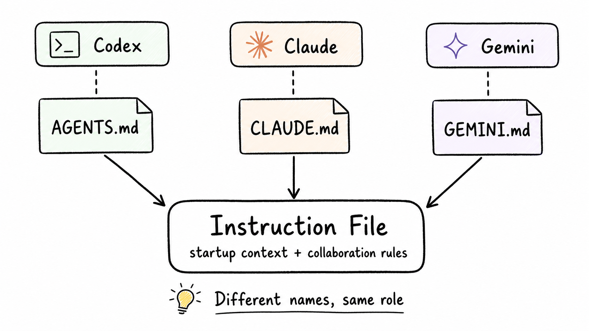
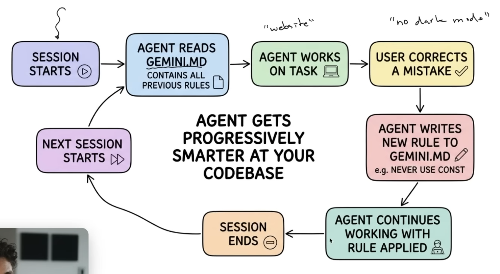

去年底開始在生活中[面對 AI 的知識焦慮](https://minglunwu.com/notes/2025/ai-knowledge-anxiety/)，我感覺身邊許多人（包含我）都被工作、社群、同儕「推著」走上一條新的學習之路。

半年過去了，我還記得自己剛起步的迷惘和焦慮，在自己的知識渠道上看到各式各樣的 AI 新知、課程、工具，資訊很多，但卻不知道自己要去哪裡，所以越看越心慌。

這篇文章並非「武力展示」或是「工具大全」，而是想分享自己從零開始摸索的過程。

如果我回到半年前的自己，要踏上與 AI 協作之路，我會先問自己兩個問題：

+ 我該如何建立自己的 AI 理解地圖 ? (mental model of AI landscape)
+ 我要怎麼開始累積經驗？

---

## 建立能安放新名詞的地圖

我還記得自己半年前很常被許多新的「詞彙」給淹沒：MCP、Skill、Harness Engineering、Claude Cowork，總是覺得「我又多了好多東西不懂」。

我覺得初學者最需要的不是追上每個新名詞，而是要建立一張能安放新名詞的理解地圖。

當我能把新名詞放回某個分類，它就不再是一個全新的未知，而是某個已知概念的變體。

舉例來說，過去常會看到有人分享 :

+ `AGENTS.md` 這樣設計，效率提升 200%!
+ GitHub 排行衝上第一的專案竟然只是 `CLAUDE.md` ?!

剛開始會覺得：天啊！這到底是什麼東西？這兩個東西我都不知道。

但當我了解這兩個檔案本質上都是 “Instruction File”，也就是 AI Session 開始執行時，會自動去閱讀的文件。只是不同的工具會有不同的檔案命名規範 (`Codex` 用的是 `AGENTS.md`、`Claude` 則是 `CLAUDE.md`)，**其實是同一回事**。

一開始建立自己的地圖時，我是看 Youtube 上的 [AI Agents Full Course 2026 : Master Agentic AI (2Hours)](https://www.youtube.com/watch?v=EsTrWCV0Ph4)，教材用 Excalidraw 繪製，講解的也很清楚，我非常推薦。

看完影片後，焦慮感消退了不少，我沒有突然懂了所有東西，只是面對網路上的新名詞，我終於能分類了！

---

## 從 Pair Programming 開始累積手感

如果說前一節處理的是：我怎麼看懂 AI 世界？

接下來要討論的就是：我怎麼開始和 AI 累積合作經驗？

記得自己剛開始要嘗試 hands-on 時，一直有種感覺：

> 「我到底要怎麼走到那裡呀？」

在我視線的遠方已經是「炫砲大亂鬥」，當初社群上都在風行養龍蝦、透過 Vibe Coding 打造出一個又一個 App、分享如何以 Multi-Agent 架構組合出一個團隊。

每個 Case 看起來都好厲害，但我這個新手該如何開始呢？我應該選定一個 Case 直接複製出來嗎？

其實我覺得這個問題的答案並不是「我要用什麼工具？」或「我要做出什麼東西？」，準確的說：**我們是在練習一種新的工作分配方式。**

什麼類型的工作我希望由我判斷？哪些工作我願意交給 AI ? 哪些工作要等我能驗證後，才敢委派？

在現實生活中，當我們要外包工作給新的協作者時，不會一開始就交付大量、重要性高的任務，而是會先「確認」這個人是否可靠、什麼樣的合作方式是安全且有效率的。

同樣的，在踏上與 AI 協作之路的初期，先「驗證」如何協作是非常重要的。

我在 [如何讓 AI 協作越用越順](https://blog.aihao.tw/2026/05/20/working-with-ai-compound/) 這篇部落格讀到 :

> 一開始跟 AI 協作，大部分人的模式是 pair programming: 短任務、快速回饋、全程盯著。這對快速迭代和原型開發很好用。

Multi-Agent 或是直接建立一個 AI Agent 或許是更成熟的做法，但並不一定是初學者最好的學習起點。

而 Pair Programming 也許不是最終形態，卻是很好的 [Learning Practice](https://minglunwu.com/notes/2026/best-learning-practice/)。

舉例來說，我可能學到了 `MCP`，但我不知道它到底對 AI 來說有什麼影響，在 Pair Programming 階段我可以快速驗證加入 `MCP` 前後的差異。

換句話說：

> 以學習為目的時，Pair Programming 的價值不只是完成任務，而是讓使用者能「觀察差異」。

那麼當我們開始進行 Pair Programming 時，究竟該觀察什麼呢？

---

### Context 是 AI 協作的基礎建設

Context，不只是 Prompt 裡的一段背景說明，而是 AI 執行任務時需要理解的整體工作脈絡。

與 AI 協作的過程中，「資料夾結構」和「文件組織方式」開始扮演 Infrastructure 的角色。

每次啟動新的 Session，都像是一個新人要 onboarding，而你的 Instruction File 就是「新同事第一天入職手冊」，可能包含：縮寫對照表、專案代號、如何閱讀文件的指引…

這些文件其實都在做同一件事：

> 將腦中的工作脈絡 Externalize，讓未來的自己、同事，甚至 AI 可以接續理解。

一開始，我覺得 Context 只是補齊背景資料，但後來發現還包含另外一個重點：**把我期待的協作方式寫清楚**。

**AI 不只需要知道「這個專案是什麼」，也需要知道「我希望你怎麼和我一起做事」**。

---

### 把協作偏好寫成行為合約

剛開始提供 Context 時，還是停留在過去 Prompt Engineering 的框架：

> “請扮演 XX 角色，協助我進行 XX 任務”

其實 Instruction File 不只是提供 Context，同時也是一份行為合約，例如：

+ 我喜歡 Step by Step 進行，每一步驟都要經過我明確同意後才執行。
+ 不確定的時候直接說不知道，不要很有自信地亂猜。
+ 請在出錯時先說明原因，不要直接重試。

行為合約會根據使用者的個性和領域有很大的不同，我喜歡每一個步驟都先看看 AI 怎麼說，然後討論沒問題後再開始執行。

但也有些使用者喜歡直接請 AI 做到底，根據成品再回過頭來調整，這兩者的行為合約就會長得完全不一樣。

入門階段最值得累積的不一定是某個作品，而是你和 AI 協作時的偏好、邊界與品味。

**一旦建立這些，協作方式就能跨任務複用，成為一套可遷移的工作習慣**。

---

### 從期待落差迭代 Instruction File

當我們開始把 Instruction File 視為一份會持續演化的協作設定後，要特別注意一點：**盡量讓 AI Session 來協助修正**。

概念非常像是 Agile 中的快速迭代，只是「執行」外包給 AI，而使用者專注在「指出差異」和「驗證效果」。

具體來說，每一次你和 AI Session 對話時冒出的「欸！你怎麼這樣做？」的瞬間，其實可能代表有一條規則需要被寫下來。

引用前面提到的 [AI Agents Full Course 2026 : Master Agentic AI (2Hours)](https://www.youtube.com/watch?v=EsTrWCV0Ph4) 中清楚的流程圖：

1. Session 啟動時，AI Session 讀取既有的 Instruction File (規則) 開始進行工作。
2. 使用者開始「**觀察**」工作過程中，是否有任何行為不符合行為合約。(不一定是任務沒有達成，有時候是以使用者非預期的方式完成。)
3. 使用者提出「**方向修正**」: 我自己會說「我注意到你沒有按照我們的規則進行檔案讀取，請你從 Instruction file 出發，檢視是哪裡誤導你，並且進行修正。」
4. AI 檢測後修正既有的 Instruction file。
5. 使用者啟動新一輪乾淨的 Session，驗證修正後的 Instruction file 是否有效。

從這個流程中可以留意一件事：我們並不是要一次把規則寫到完美，而是透過一次次互動，把每一個「我以為你懂」的地方釐清，並轉換成具體的規則，

當這些規則逐漸穩定下來，AI 就不只是一次性的工具，會慢慢變成你更可靠的協作者。

---

## 如果回到起點

現在如果回到半年前，我想和當時的自己分享：追不上每一個新工具是正常的，也不需要把目標放在做出很厲害的 AI Agent 應用。

先建立一張能安放新名詞的理解地圖，讓自己看到新東西時不再陷入茫然與迷惘。

接著，從 Pair Programming 開始，理解 AI 需要什麼樣的 Context、摸索讓你感到自在的協作方式，並在過程中把每一次的期待落差更新回 Instuction File。

這樣的起步看起來不炫，但是一種很好的 [Learning Practice](https://minglunwu.com/notes/2026/best-learning-practice/)。

如果你也正在學習 AI 協作，希望這篇文章可以幫上你，一起加油！

謝謝你的閱讀，我們下次見。

---

## About Byte & Ink

我會定期在部落格分享不同主題的文章，目前包含：

+ [職涯心得](https://minglunwu.com/tags/career/)
+ [個人成長](https://minglunwu.com/categories/reflection/)
+ [筆記軟體 - Obsidian 教學](http://minglunwu.com/categories/obsidian/)
+ 技術相關 (`K8S`, `DevOps`, `軟體測試`...)

如果你覺得內容有幫助，歡迎你[點此](https://minglunwu.substack.com/subscribe)訂閱我的文章，你的訂閱會帶給我更多動力，持續分享有意義的內容！
