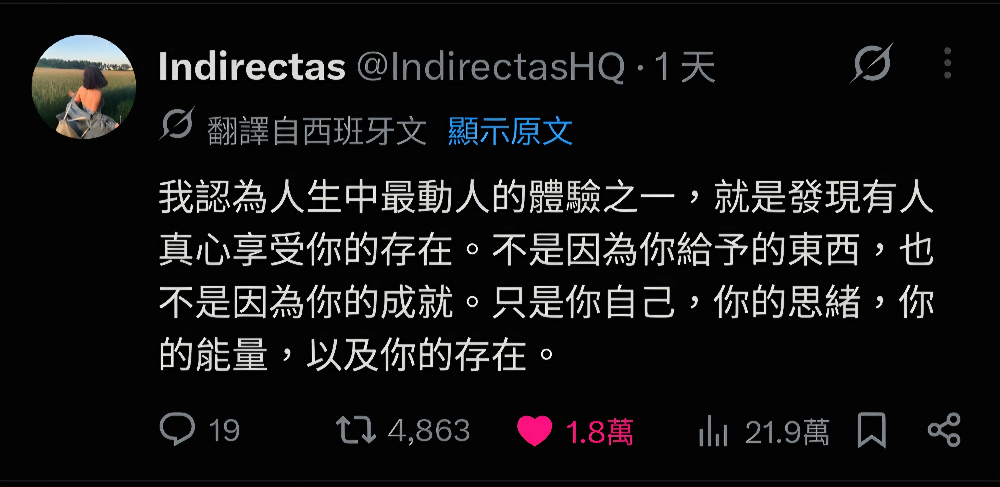

(本篇內容無使用 AI 工具協作)

## 關於寫作

自從在 Medium 發表[第一篇文章](https://medium.com/@minglun-wu/%E8%BB%8D%E4%BA%8B%E8%A8%93%E7%B7%B4%E5%BD%B9100%E6%A2%AF%E7%B6%93%E9%A9%97%E5%88%86%E4%BA%AB-%E5%98%89%E7%BE%A9%E4%B8%AD%E5%9D%91%E6%96%B0%E8%A8%93-b85ea1e9fbf4)至今，已經過了七年了。

哇！七年！除了驚訝，也替自己感到些許驕傲。

回顧當初踏上寫作之旅的契機，我覺得是「自卑感」，讓我想要做點事情來證明自己。

寫作的過程中，常遇到撞牆期，更新的頻率也忽高忽低，儘管如此，寫著寫著，這段旅程確實帶給我一些東西。

最近花了點時間整理，究竟寫作帶給我什麼樣的影響？

我想藉由這樣的分享，來鼓勵曾想過要嘗試寫作、或正在觀望中的讀者朋友們，踏上這趟旅程。

---

## 寫作帶給我什麼影響？

我認為寫作帶給我三個重要的影響。

---

### 提升「非同步溝通」的能力

我覺得在職場中「非同步溝通」是一項極為重要的技能。

每個人的專注力是十分珍貴的，善用「非同步溝通」能替自己和身邊的工作夥伴省下大量的專注力，去做真正有價值的事。

你能否透過文件、Ticket、電子郵件來進行有效的「非同步溝通」？ 你能否判斷當下的場景該使用哪一種溝通方式？

對我來說，這是有生產力的團隊成員必須具備的重要技能。

我在[剛加入團隊的新人，可以做些什麼？ - 非線性的學習路徑](https://minglunwu.com/notes/2022/new_member/#%E9%9D%9E%E7%B7%9A%E6%80%A7%E7%9A%84%E5%AD%B8%E7%BF%92%E8%B7%AF%E5%BE%91)分享過：我們習慣的「學習」是從「線性」的資訊中，嘗試「還原」出「非線性」的知識。

而寫作則是一種反向的訓練：把腦海中「非線性」的資訊，嘗試以「線性」的媒介呈現。

為了讓讀者更容易理解，你得去思考這段文字的「目標受眾」是誰？他們有什麼樣的背景知識？該用什麼樣的順序去闡述，讀者會吸收得更好？

在寫作過程中，你會自然而然地思考這些問題，開始站在讀者的立場換位思考，這有助於在工作時寫出「溝通效率高」的文字。

這是寫作帶給我的第一個影響。

---

### 感受到自己的價值

我是在寫作的過程中，慢慢感受到自己的價值。

我在[寫給剛踏入職場的自己](https://minglunwu.com/notes/2025/early-career-reflection/)中有提過，剛離開學校時，曾因周圍的人和自己做出不同的職涯選擇，陷入一段時間的不安。

現在回頭看那樣的情緒，我覺得是**對自己的選擇與判斷不夠有自信**。

那個時候很常問自己：「我要進到什麼樣的公司，才算是一份好工作？」、「我是不是放假也得做點什麼，看起來才不會很廢？」

我不認為這樣的問題有標準答案，或者說，我在想，當初的我可能問錯問題了。

最近幾年在[諮商](https://minglunwu.com/notes/2025/start_therapy_journey.html/)的過程中，我覺得對自己的選擇不夠有自信，背後其實是「自我價值」的匱乏，也就是「我看不到自己的價值」，所以不敢相信自己的選擇。

現在的我會重新改寫當初的問題：

+ 我是怎麼看待自己的價值？
+ 我覺得自己是一個有價值的人嗎？

隨著我持續寫作，我開始意識到：

> 光是記錄自己腦中的奇思妙想，就是一件有價值的事！

當我發現自己寫出來的東西，是確實能造成別人的共鳴，甚至對他人產生影響時，感受到一股極強烈的情緒：

> 原來我不需要做什麼，也不需要刻意扮演什麼角色。只需要把內心思考的事情分享出來，這本身就是一件有價值的行為。

前陣子在 Thread 上看到的 Post 很符合這種感受：

在寫作過程中逐漸累積的價值感，是鼓舞我持續寫下去的動力之一。

---

### 有機會認識志同道合的社群夥伴

我是個「被動社交」的人：不太敢主動提出邀約、被邀約通常會開心答應、出門前開始焦慮、碰面後慶幸自己有赴約。

收到邀約，總是開心的，我很感謝「寫作」讓我有機會認識日常社交圈以外的人。

前陣子安排了 [Gap week](https://minglunwu.com/notes/2026/gap-week/)，休假前意外的收到 [Kyo](https://kyomind.tw/) 的邀約。

前幾年在讀他的[部落格](https://blog.kyomind.tw/)時，一直很欣賞他的文章，除了深入且扎實的技術主題外，也有許多我感興趣的題材，例如 [Cal Newport](https://blog.kyomind.tw/think-riverside/) 及對[多種筆記軟體的觀察](https://blog.kyomind.tw/categories/%E7%AD%86%E8%A8%98%E8%BB%9F%E9%AB%94/)。

寫完[《踏實感的練習》：把目標從外在成效，調整成內在踏實感](https://minglunwu.com/notes/2025/from-productivity-to-groundedness/) 後，收到他的留言回饋，當下十分驚喜，讓我更加確定在某部分的價值觀上，我們是志同道合的同好。

先前在讀《The Pathless Path - 無路之路》時，有一段讓我印象的深刻的文字：

>「社群」是走在非傳統職涯上必不可缺的燃料。

和 [Kyo](https://kyomind.tw/) 碰面時，我發現在聊寫作時，不需要過多鋪陳，就能很自在的闡述彼此的心得、價值觀及曾遭遇過的痛點。

雖然是第一次見面，但我察覺自己很輕易的進入「心流」，腦海中的想法源源不絕的冒出來，這是在日常生活中，我很少體驗到的狀態。

對話中，得到許多有意思的觀點，也藉此發現有些問題其實自己還沒有想清楚。

正是這次碰面，讓我開始整理「寫作」對我的意義，從而催生出了這篇文章！

(如果你對於我的文字有共鳴，也歡迎你約我聊聊，說不定我們也是失散已久的社群夥伴？😄)

---

## 關於寫作的反思與建議

我一直很喜歡一句話：「[成為你曾經需要的那個人](https://minglunwu.com/notes/2025/early-career-reflection/)」。

如果是現在的我，會給當初準備開始寫作的自己什麼建議呢？

---

### 建立並相信自己的「品味」

剛開始寫作時，常抱持一種想法：「我要寫別人沒寫過的東西！」，但在 AI 蓬勃發展的時代，我想越來越難找到這種類型的題材。

例如我 2022 年開始使用 `Obsidian`，當時的筆記主流還是 `Notion`，為了想分享 `Obsidian` 的好，所以才出現了 [Obsidian 系列](https://minglunwu.com/categories/obsidian/)。

 隨著 LLM 出現，`Obsidian` 一夕爆紅，我反而覺得「哎呀！已經有很多人在分享了，好像沒必要分享了」，系列文也因此暫時進入停更狀態。

這種心態在大 AI 時代反而讓寫作變得寸步難行，選題時常會懷疑：「我到底還要寫些什麼？我寫的東西 AI 都已經知道了，那我還有必要寫嗎？」

我很喜歡 [Kyo](https://kyomind.tw/) 分享的概念：寫作的過程就像是「**知識的策展**」。

前幾天讀到 Huil 大大的 [AI 與鴨子，惰性與真實](https://life.huli.tw/2026/01/03/ai-and-duck-lazy-and-fact) ，裡面提到：

> “科技的進步，讓電子垃圾也變得越來越多。”

當 AI 的進步讓越來越多人能透過大量的垃圾而獲利時，在我們的周遭就會充斥越來越多粗製濫造的內容，試圖奪走你珍貴的專注力。

最近讀了林琪香的《摘柿記》，是我近年來最喜歡的散文，閱讀過程中帶來的喜悅，是看再多篇「不是…而是…」的 AI 文章都無法替代的。

這讓我意識到：與其「創造」沒有人寫過的題材，不如「選擇」自己感興趣的題材。

對我來說，這是一種建立「品味」的過程，也就是**你對於珍貴事物的「判斷」**，這種判斷是非常主觀的。

若從「策展」的角度出發，寫作除了「選擇題材」外，還有試著在文字中「揉入自己的想法與價值觀」，從而創造出文章的「自我度」- 工作、職稱都是可以被取代的，只有我寫出的文字，能夠體現出差異，這種差異像是一種證明：「我就是我，我是不可被取代的」。

前陣子寫作時，非常依賴 AI，我會請 AI 協助我發想標題、編排骨架，整理摘要後再由我改寫。

產出文章的速度確實上升了，但我發現對於自己文章的共鳴卻下降了，換句話說：我得到許多「完成度」很高，但「自我度」很低的文章。

這有點像是「品質」與「品味」的取捨。

「品質」對我來說，是我對於這份素材的「信心程度」，當我查證過資料來源，確定內容正確，我會認爲這段文字是有「品質」的。

如果今天談論的是客觀的知識，我相信 AI 無論是廣度與深度，最終得到的「品質」，都遠勝於人類。

而「品味」則取決於個人的成長背景、看過的書、走過的路、經歷過的風浪。

我想寫作的本質並不單純是分享知識（在大 AI 時代，恐怕不需要特別依靠我的分享），而是把此時此刻覺得重要的事物和心態給「留存」下來，先前在[一個觀念，改變你的筆記習慣](https://medium.com/@minglun-wu/%E4%B8%80%E5%80%8B%E8%A7%80%E5%BF%B5-%E6%94%B9%E8%AE%8A%E4%BD%A0%E7%9A%84%E7%AD%86%E8%A8%98%E7%BF%92%E6%85%A3-b25e3a32f2f4)中的一段話特別符合現在的感受：

> “閱讀主觀感受時，最能讓人產生共鳴、身歷其境地感受特定時刻的記憶。”

**「品味」的來源，正是文章中的主觀想法。**

意識到這件事後，我開始想寫出「自我度」高，「完成度」未必高的文章。

當我把寫作中的越多部分外包給 AI，是不是代表我開始不信任自己的「品味」？我認為大量資料訓練出來的語言模型，比我更能代表我自己？

如果我是一個「策展人」，我希望自己能開始「創造並相信自己的品味」，抱持一種信念：「**我是在送一份有價值的禮物給世界上的某人**」。

儘管我不知道這個人是誰，我仍然相信我寫的東西是有價值的、是會對他人產生影響的。

---

### 先把目標讀者設定成「未來的自己」

寫作之旅的前幾篇是最困難的，很容易出現「哇！這東西寫出來真的會有人要看嗎？」的小劇場。

我蠻喜歡[我為什麼鼓勵工程師寫 blog](https://dotblogs.com.tw/hatelove/2017/03/26/why-engineers-should-keep-blogging)中的觀點，把寫作當成是一種「日記」壓力會小一點，將目標讀者設定成「未來某個時刻的自己」，記錄每個時期對什麼內容感興趣，累積一段時間後，可以直觀的觀察到自己的變化。

把你此時此刻認為重要的事記錄下來，可能是正在學習的技術（2020 年剛踏入職場寫的[安裝 Miniconda 以及 Pytorch](https://minglunwu.com/notes/2020/20200318.html/))、或是自己的體悟（2022 年剛轉職時寫下的[剛加入團隊的新人，可以做些什麼？](https://medium.com/@minglun-wu/%E5%89%9B%E5%8A%A0%E5%85%A5%E5%9C%98%E9%9A%8A%E7%9A%84%E6%96%B0%E4%BA%BA-%E5%8F%AF%E4%BB%A5%E5%81%9A%E4%BA%9B%E4%BB%80%E9%BA%BC-f8b716940fe1))。

把這些重要的事情留存下來，在某些時刻是很方便的，不只能提醒未來的自己，也能在需要時直接「匯出」給他人。

最近剛好在帶一個 Mentee，進行 Code Review 時，發現有些原則需要溝通，此時要把自己內化的原則整理出來會有點花時間，但剛好當初在學習 Code Review 的概念時，有留下一篇紀錄 - [成為更重視 Code Review 的工程師](https://minglunwu.com/notes/2024/code_review.html/)，這時候就派上用場了！直接傳連結給他，搞定！

---

## 帶給我寫作啟發的來源

在寫作之路上，我特別喜歡幾位前輩對於寫作的觀點，謝謝他們的引領，讓我持續走到今天，以下分享幾篇帶給我重要影響的文章或書籍：

+ [我為什麼寫部落格，以及部落格帶給我的影響 \| by Huli \| Medium](https://hulitw.medium.com/blog-e7a23a74ae2b)
+ [每一篇心得都有價值——為什麼初學者才更應該要寫心得筆記 \| by Huli \| Medium](https://hulitw.medium.com/why-blogging-ab77fd8c6ffa)
+ [我為什麼鼓勵工程師寫 blog](https://dotblogs.com.tw/hatelove/2017/03/26/why-engineers-should-keep-blogging)
+ [時間看得見，所以不要再偷懶了 - Ruby 的藝文生活](https://rubycheniju.com/long-term-thinking/?utm_source=rss&utm_medium=rss&utm_campaign=long-term-thinking)
+ 《寫作課：一隻鳥接著一隻鳥寫就對了！》
+ 《寫作，是最好的自我投資》

謝謝你的閱讀，希望你有朝一日也有機會踏上寫作的旅程，我們下次見。

---

## About Byte & Ink

我會定期在部落格分享不同主題的文章，目前包含：

+ [職涯心得](https://minglunwu.com/tags/career/)
+ [個人成長](https://minglunwu.com/categories/reflection/)
+ [筆記軟體 - Obsidian 教學](http://minglunwu.com/categories/obsidian/)
+ 技術相關 (`K8S`, `DevOps`, `軟體測試`...)

如果你覺得內容有幫助，歡迎你[點此](https://minglunwu.substack.com/subscribe)訂閱我的文章，你的訂閱會帶給我更多動力，持續分享有意義的內容！
